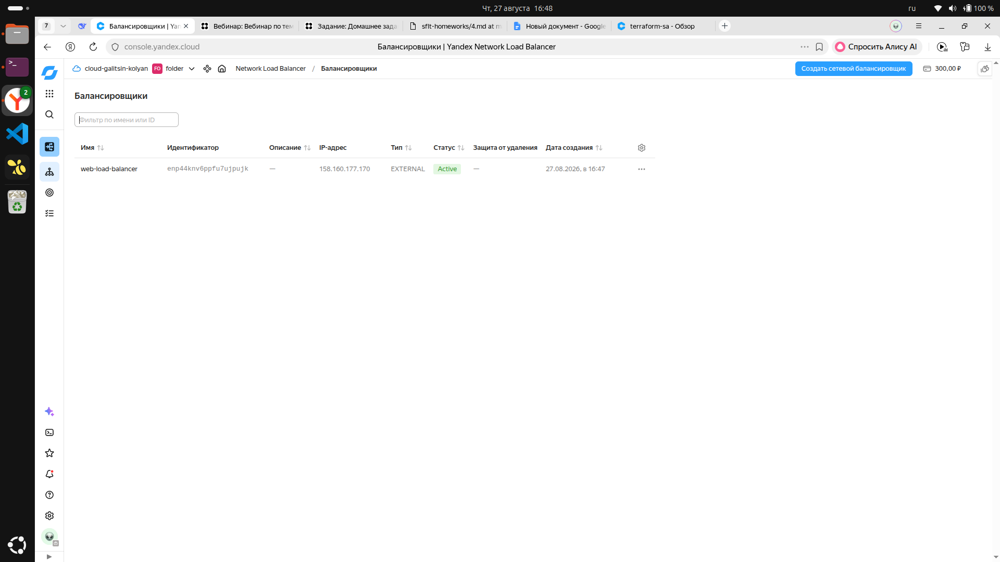
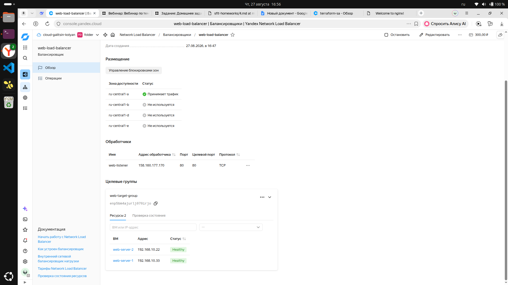
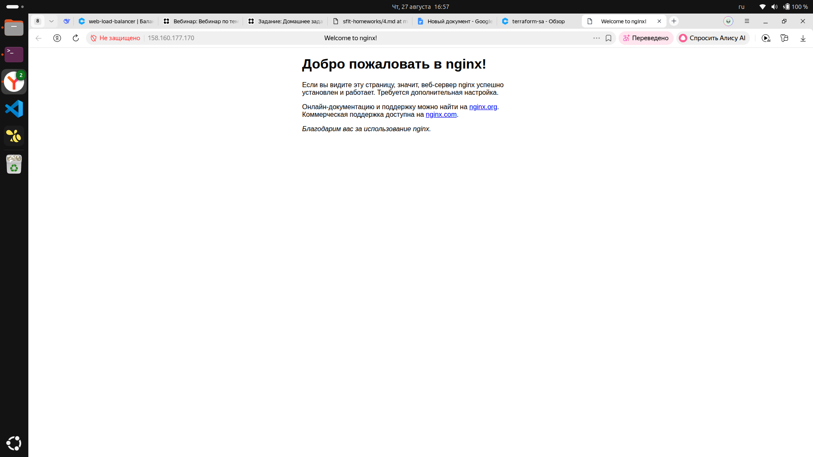

# Отчет о выполнении задания: Подъём инфраструктуры в Яндекс Облаке с балансировщиком нагрузки

**Выполнил:** Галицин Николай

## Цель работы

Развернуть в Yandex Cloud инфраструктуру, состоящую из VPC сети, двух идентичных веб-серверов с Nginx, целевой группы и сетевого балансировщика нагрузки с healthcheck на порту 80.

## Используемые технологии

- **Terraform** v1.15.9
- **Yandex Cloud Provider** v0.72.0
- **Nginx** (автоматическая установка через user-data)
- **Ubuntu 22.04 LTS**

## Структура проекта
Cloud/
├── screenshots/ # Скриншоты результатов
│ ├── balancer-status.png
│ ├── target-group.png
│ └── nginx-page.png
├── key.json # Авторизованный ключ сервисного аккаунта
├── main.tf # Основная конфигурация ресурсов
├── outputs.tf # Вывод результатов
├── provider.tf # Настройка провайдера Yandex Cloud
├── terraform.tfvars # Значения переменных
└── variables.tf # Объявление переменных

## Ход выполнения работы

### 1. Подготовка окружения

- Установлен Terraform через `snap install terraform --classic`
- Создан сервисный аккаунт `terraform-sa` с ролью `editor`
- Получен авторизованный ключ `key.json`

### 2. Создание инфраструктуры

| Ресурс | Имя | Параметры |
|--------|-----|-----------|
| VPC сеть | lb-network | — |
| Подсеть | lb-subnet | 192.168.10.0/24, ru-central1-a |
| Группа безопасности | web-sg | Порты 80, 22, healthcheck |
| VM 1 | web-server-1 | 2 vCPU, 2GB RAM, 10GB HDD |
| VM 2 | web-server-2 | 2 vCPU, 2GB RAM, 10GB HDD |
| Целевая группа | web-target-group | 2 цели |
| Балансировщик | web-load-balancer | external, порт 80 |

## Результаты

### Статус балансировщика

Балансировщик находится в статусе **Active**.

### Целевая группа

Обе виртуальные машины в состоянии **Healthy**.

### Проверка Nginx

При запросе на IP балансировщика получена страница Nginx.

## Выводы

Все задачи выполнены успешно:

- ✅ Созданы 2 идентичные VM с Nginx
- ✅ Настроена целевая группа
- ✅ Создан балансировщик нагрузки с healthcheck
- ✅ Подтверждена работоспособность инфраструктуры
